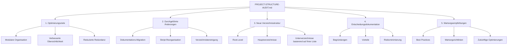

# Plan für PROJECT-STRUCTURE-AUDIT.md

## Gliederung

## Kontext der bisherigen Änderungen:
1. Dokumentations-Migration:
   - 76 Dateien von docs/ nach ai_docs/ verschoben
   - docs/ Verzeichnis entfernt

2. Skript-Reorganisation:
   - 5 Root-Skripte in entsprechende Module verschoben
   - Nur saar.sh verbleibt im Root

3. Verzeichnisbereinigung:
   - mcp_servers/ aufgelöst und in libs/mcp integriert
   - projects/ nach apps/ und configs/ migriert
   - logs/ in .gitignore/.claudeignore aufgenommen
   - tools/ neu strukturiert (scripts/, generators/)

## Dokumentationsanforderungen:
1. Überblick der Optimierungsziele
2. Detaillierte Auflistung aller Änderungen
3. Neue Verzeichnisstruktur (basierend auf der vom Benutzer bereitgestellten Liste)
4. Begründungen für Entscheidungen
5. Empfehlungen für zukünftige Wartung

## Wichtig:
- Dokumentiere NUR die Strukturoptimierungen
- Verwende klare Markdown-Formatierung
- Die Dokumentation soll als Referenz für zukünftige Entwickler dienen