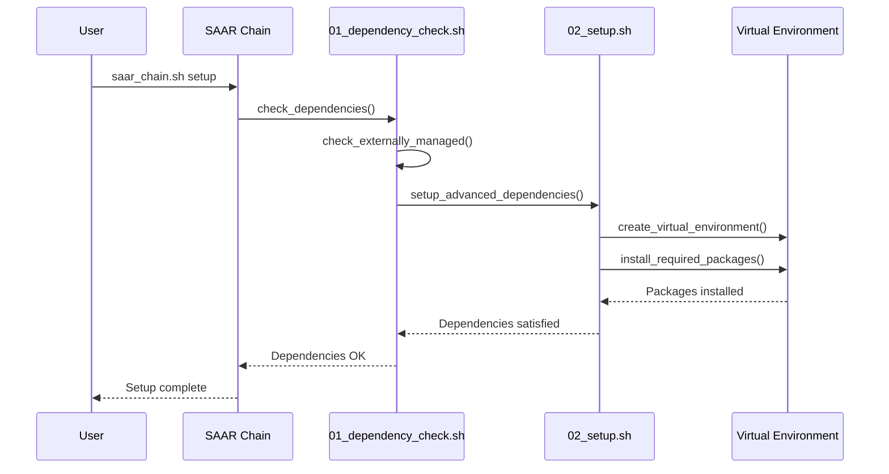
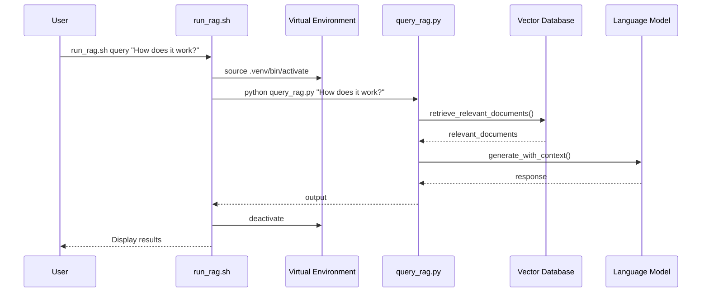

# Virtual Environment SAAR Integration

## Overview

This document describes how the Python virtual environment system is integrated with the SAAR (Setup, Activate, Apply, Run) chain in the Claude Neural Framework. This integration ensures that all Python operations are executed in an isolated environment, avoiding conflicts with system packages and respecting modern Python security practices like PEP 668.

## Integration Points

### 1. SAAR Chain Script

The main `saar_chain.sh` script has been enhanced to automatically detect and handle externally-managed Python environments. Key integration points:

1. **Dependency Check**: Enhanced to look for Python packages in the virtual environment
2. **Setup Process**: Modified to create and use a virtual environment
3. **Error Handling**: Added special logic for externally-managed-environment errors

### 2. Startup Scripts

The startup module scripts have been updated to use the virtual environment:

1. **00_common.sh**: Enhanced run_command function detects and handles Python errors
2. **01_dependency_check.sh**: Modified to check and install packages in virtual environment
3. **02_setup.sh**: Updated to setup the virtual environment during initial configuration
4. **04_debug_components.sh**: Fixed syntax errors and enhanced environment compatibility
5. **05_neural_framework.sh**: Added virtual environment compatibility functions

### 3. RAG System Configuration

The RAG (Retrieval Augmented Generation) system is fully integrated with the virtual environment:

1. **setup_rag.sh**: Dedicated script to set up the RAG virtual environment
2. **run_rag.sh**: Runner script that handles environment activation for RAG commands
3. **activate_venv.sh**: Helper script for manual environment activation

## Environment Variables

The integration uses the following environment variables:

1. **VENV_DIR**: Path to the virtual environment (default: `$WORKSPACE_DIR/.venv`)
2. **PYTHON_PACKAGES_USE_VENV**: Flag indicating that Python packages should use virtual environment
3. **CONFIG_DIR**: Path to the configuration directory

## Implementation Details

### 1. Virtual Environment Detection

```bash
# Check if virtual environment exists
if [ -d "$WORKSPACE_DIR/.venv" ]; then
  log "DEBUG" "Found existing Python virtual environment"
  # Prefer the virtual environment
  export PYTHON_PACKAGES_USE_VENV=true
else
  log "DEBUG" "No Python virtual environment found"
  # Check if system Python environment is externally managed
  if python3 -c "import sys; sys.exit(0 if getattr(sys, 'base_prefix', None) == sys.prefix else 1)" &> /dev/null && \
     python3 -m pip install --dry-run anthropic 2>&1 | grep -q "externally-managed-environment"; then
    log "WARN" "Detected externally-managed Python environment"
    log "INFO" "Will create and use a virtual environment for Python packages"
    export PYTHON_PACKAGES_USE_VENV=true
  fi
fi
```

### 2. Run Command Enhancement

The `run_command` function in `00_common.sh` has been enhanced to detect and handle Python-related errors:

```bash
# Check for specific Python errors
if grep -q "externally-managed-environment" "$error_file"; then
  log "WARN" "Detected externally-managed-environment error in Python"
  log "INFO" "Will attempt to use a virtual environment instead"
  
  # Special handling for Python pip errors
  if [[ "$command" == *"pip install"* ]]; then
    # Extract just the package list from the pip install command
    local packages=$(echo "$command" | grep -o "pip install [^\"]*" | sed 's/pip install //')
    
    # Alternative approach using virtual environment
    log "INFO" "Attempting to install packages ($packages) in a virtual environment"
    
    # Create and use a virtual environment
    # ...
  fi
fi
```

### 3. Package Installation

When installing Python packages, the system now uses the virtual environment:

```bash
# Check if virtual environment should be used
if [ "$PYTHON_PACKAGES_USE_VENV" = "true" ]; then
  log "INFO" "Installing packages in virtual environment"
  
  # Create virtual environment if it doesn't exist
  if [ ! -d "$VENV_DIR" ]; then
    run_command "python3 -m venv $VENV_DIR" "Failed to create virtual environment"
  fi
  
  # Activate and install
  source "$VENV_DIR/bin/activate"
  run_command "pip install $packages" "Failed to install packages in virtual environment"
  deactivate
else
  log "INFO" "Installing packages system-wide"
  run_command "pip install $packages" "Failed to install packages"
fi
```

## Workflow Examples

### 1. Setup Workflow



### 2. RAG Command Workflow



## Future Enhancements

1. **Automated Environment Updates**: Periodically check and update packages
2. **Environment Isolation Levels**: Support for different isolation strategies
3. **Project-Specific Environments**: Support multiple environments for different projects
4. **Requirements Management**: Enhanced tracking of package requirements
5. **Environment Sharing**: Export and import environment configurations