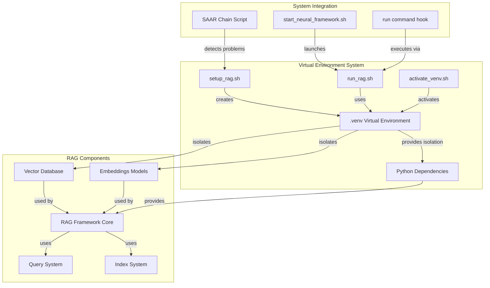
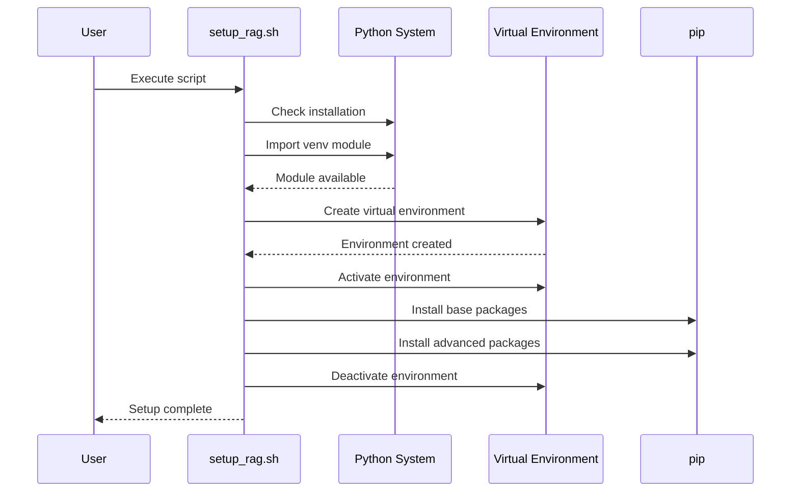
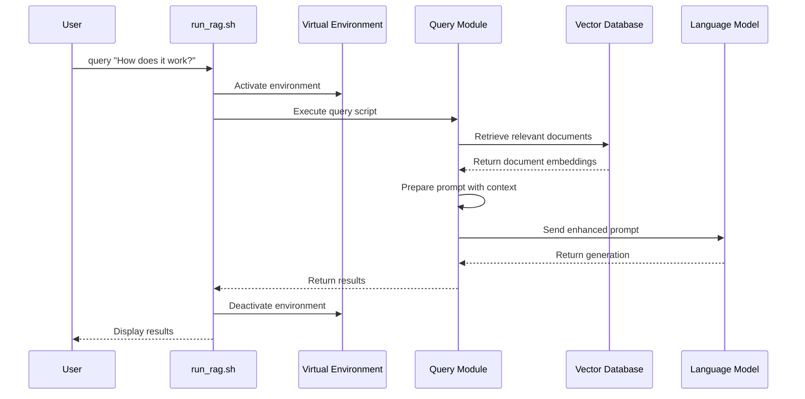

# Virtual Environment Design Model

## System Overview

The Virtual Environment Design Model represents the architectural decisions and components related to Python dependency management within the Claude Neural Framework, particularly focusing on RAG and AI components.

## Core Components

1. **Virtual Environment Container**: The `.venv` directory containing isolated Python installation
2. **Environment Management Scripts**: 
   - `setup_rag.sh`: Creates and configures the environment
   - `activate_venv.sh`: Activates the environment for direct use
   - `run_rag.sh`: Runs commands within the environment
3. **RAG Component Systems**:
   - Framework Core: Orchestration and integration
   - Query System: Handles user queries
   - Index System: Manages document indexing
   - Vector Database: Stores and retrieves embeddings
   - Embeddings Models: Converts text to vector representations

## Component Interactions

### Environment Setup Flow

### Query Execution Flow

## Design Principles

1. **Isolation**: Keep Python dependencies isolated from the system Python
2. **Transparency**: Environmental activation should be automatic and invisible
3. **Compatibility**: Support for modern Python security practices (PEP 668)
4. **Consistency**: Environment configuration should be identical across systems
5. **Simplicity**: Provide simple interfaces for common operations

## Extension Points

1. **Custom Embedding Models**: Add specialized models by installing in the virtual environment
2. **Alternative Vector Databases**: Integration with different vector storage systems
3. **Integration Hooks**: Connection points with other framework components
4. **Monitoring Extensions**: Add telemetry and performance monitoring