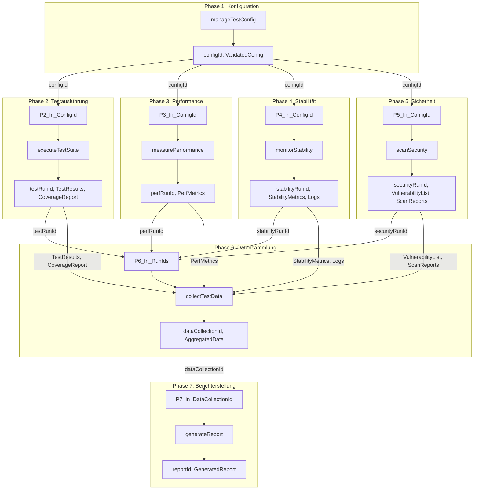

# Entwurf: Workflow-Plan für Qualitätssicherung im `agent.saarland` Projekt

## 1. Zielsetzung des Workflows

Dieser Workflow dient der systematischen und automatisierten Überprüfung der Qualität des `agent.saarland` Projekts hinsichtlich Performance, Stabilität, Sicherheit und funktionaler Korrektheit. Er nutzt die Tools des "QualityGuard MCP"-Servers, um reproduzierbare und nachvollziehbare Qualitätssicherungszyklen zu ermöglichen.

## 2. Workflow-Phasen und Tool-Sequenz

Der Qualitätssicherungszyklus ist in die folgenden Phasen unterteilt. Jede Phase nutzt spezifische Tools des "QualityGuard MCP"-Servers.

```mermaid
graph TD
    A[Phase 1: Konfiguration & Vorbereitung] --> B(Phase 2: Testausführung);
    B --> C{Entscheidung: Kritische Fehler?};
    C -- Nein --> D[Phase 3: Performance-Messung];
    C -- Ja --> J[Phase 7: Berichterstellung (Fehlerbericht)];
    D --> E[Phase 4: Stabilitätsmonitoring];
    E --> F[Phase 5: Sicherheits-Scan];
    F --> G[Phase 6: Datensammlung];
    G --> H[Phase 7: Berichterstellung (Umfassender Bericht)];
    H --> I[Phase 8: Ergebnis-Archivierung & Benachrichtigung];

    subgraph "QualityGuard MCP Tools"
        T1[manageTestConfig]
        T2[executeTestSuite]
        T3[measurePerformance]
        T4[monitorStability]
        T5[scanSecurity]
        T6[collectTestData]
        T7[generateReport]
    end

    A -- Ruft auf --> T1;
    B -- Ruft auf --> T2;
    D -- Ruft auf --> T3;
    E -- Ruft auf --> T4;
    F -- Ruft auf --> T5;
    G -- Ruft auf --> T6;
    J -- Ruft auf --> T7;
    H -- Ruft auf --> T7;
```

**Phase 1: Konfiguration & Vorbereitung**
*   **Tool:** `manageTestConfig`
*   **Zweck:** Laden und Validieren der spezifischen Testkonfiguration für den aktuellen Workflow-Lauf (z.B. Smoke-Test, Full-Audit, spezifisches Szenario). Dies beinhaltet die Auswahl der Testumgebung, der zu testenden Komponenten/Anwendungen (`apps/cli`, `apps/api`, spezifische `libs`), Lastprofile, Feature-Flags etc.
*   **Parameterisierung (Beispiele):**
    *   `configName`: Name der zu ladenden Konfiguration (z.B. "daily_smoke_api", "weekly_audit_full").
    *   `environmentSetup`: Details zur Docker-Umgebung (z.B. welche `docker-compose.yml` Datei, welche Services gestartet werden sollen).
    *   `overrideParams`: Optionale Parameter, um spezifische Konfigurationswerte zur Laufzeit zu überschreiben.
*   **Output:** Validierte und geladene Testkonfiguration, ID der Konfiguration für spätere Referenz.

**Phase 2: Testausführung (Funktionale Tests)**
*   **Tool:** `executeTestSuite`
*   **Zweck:** Ausführung der definierten Test-Suiten (Unit-, Integrations-, API-Tests) basierend auf der geladenen Konfiguration.
*   **Parameterisierung (Beispiele):**
    *   `configId`: ID der geladenen Testkonfiguration aus Phase 1.
    *   `suiteName`: Name der auszuführenden Test-Suite (z.B. "core_security_unit_tests", "api_agent_interaction_tests", "cli_saar_workflow_tests"). Kann auch "all_applicable" sein, basierend auf der Konfiguration.
    *   `testScope`: Welche Teile des Projekts getestet werden sollen (z.B. "libs/core", "apps/api/endpoints/agent", "full_system").
    *   `coverageEnabled`: `true` / `false` (ob Code-Coverage-Daten gesammelt werden sollen).
*   **Output:** Detaillierte Testergebnisse (Pass/Fail pro Testfall, Fehlerdetails, Logs), Coverage-Bericht (falls aktiviert), ID des Testlaufs.
*   **Datenfluss:** Ergebnisse werden für `collectTestData` und `generateReport` bereitgestellt.

**Phase 3: Performance-Messung**
*   **Tool:** `measurePerformance`
*   **Zweck:** Messung der Performance kritischer Operationen und Endpunkte unter definierter Last.
*   **Parameterisierung (Beispiele):**
    *   `configId`: ID der geladenen Testkonfiguration.
    *   `operationName`: Name der zu messenden Operation (z.B. "api_rag_query_latency", "cli_agent_init_time", "mcp_sequential_planner_throughput").
    *   `loadProfile`: Name des zu verwendenden Lastprofils (z.B. "medium_concurrent_users", "high_request_rate").
    *   `duration`: Dauer des Performance-Tests.
    *   `targetComponent`: Die Komponente, deren Performance gemessen wird (z.B. `apps/api`, `apps/cli`).
*   **Output:** Performance-Metriken (Antwortzeiten, Durchsatz, Fehlerraten, Ressourcennutzung), ID des Performance-Messlaufs.
*   **Datenfluss:** Metriken werden für `collectTestData` und `generateReport` bereitgestellt.

**Phase 4: Stabilitätsmonitoring**
*   **Tool:** `monitorStability`
*   **Zweck:** Überwachung des Systems unter Dauerlast oder bei spezifischen Stress-Szenarien, um Stabilitätsprobleme (Fehlerraten, Abstürze, Memory Leaks) zu identifizieren. Dies kann parallel zu anderen Tests oder als dedizierter Langzeittest laufen.
*   **Parameterisierung (Beispiele):**
    *   `configId`: ID der geladenen Testkonfiguration.
    *   `monitoringProfile`: Name des Stabilitätsprofils (z.B. "long_term_soak_test", "fuzzing_input_robustness", "error_injection_recovery").
    *   `duration`: Dauer des Stabilitätsmonitorings.
    *   `targetComponent`: Die zu überwachende Komponente.
*   **Output:** Stabilitätsmetriken (Fehlerraten über Zeit, MTBF, RTO, Log-Auszüge bei Fehlern), ID des Stabilitätslaufs.
*   **Datenfluss:** Metriken und Logs werden für `collectTestData` und `generateReport` bereitgestellt.

**Phase 5: Sicherheits-Scan**
*   **Tool:** `scanSecurity`
*   **Zweck:** Durchführung automatisierter Sicherheitsscans (Abhängigkeiten, statische Code-Analyse, ggf. dynamische Scans).
*   **Parameterisierung (Beispiele):**
    *   `configId`: ID der geladenen Testkonfiguration.
    *   `scanProfile`: Name des Scan-Profils (z.B. "dependency_check_critical", "sast_full_scan", "input_validation_audit").
    *   `targetScope`: Welche Teile des Projekts gescannt werden sollen.
*   **Output:** Liste identifizierter Schwachstellen (inkl. Schweregrad), Scan-Berichte, ID des Sicherheits-Scans.
*   **Datenfluss:** Ergebnisse werden für `collectTestData` und `generateReport` bereitgestellt.

**Phase 6: Datensammlung**
*   **Tool:** `collectTestData`
*   **Zweck:** Sammeln und Aggregieren aller relevanten Daten aus den vorherigen Phasen (Testergebnisse, Performance-Metriken, Stabilitätsdaten, Sicherheits-Scan-Ergebnisse, Logs).
*   **Parameterisierung (Beispiele):**
    *   `runIds`: Eine Liste der IDs der einzelnen Test-, Mess-, Monitoring- und Scan-Läufe.
    *   `aggregationLevel`: Wie detailliert die Daten aggregiert werden sollen (z.B. "summary", "detailed").
    *   `storageTarget`: Wo die Rohdaten temporär oder persistent gespeichert werden sollen (intern im MCP oder Referenz zu externem Speicher).
*   **Output:** Aggregierte und strukturierte Datensammlung, ID der Datensammlung.

**Phase 7: Berichterstellung**
*   **Tool:** `generateReport`
*   **Zweck:** Erstellung eines umfassenden Qualitätsberichts basierend auf den gesammelten Daten.
*   **Parameterisierung (Beispiele):**
    *   `dataCollectionId`: ID der aggregierten Datensammlung aus Phase 6.
    *   `reportType`: Art des Berichts (z.B. "summary_dashboard", "detailed_audit_log", "delta_to_baseline").
    *   `outputFormat`: Format des Berichts (z.B. "markdown", "html", "json").
    *   `comparisonBaselineId` (optional): ID eines vorherigen Berichts/Datensatzes für Vergleichszwecke.
*   **Output:** Generierter Bericht, ID des Berichts.

**Phase 8: Ergebnis-Archivierung & Benachrichtigung**
*   **Zweck:** Speicherung des finalen Berichts und der gesammelten Daten an einem definierten Ort und Benachrichtigung der relevanten Stakeholder.
*   **Dies ist keine direkte Tool-Funktion des "QualityGuard MCP", sondern ein nachgelagerter Prozess, der durch den Workflow-Orchestrator (z.B. `SequentialPlanner` oder CI/CD-System) gesteuert wird.**
*   **Aktionen:**
    *   Speichern des Berichts in einem Artefakt-Repository oder Dokumentenmanagementsystem (z.B. in `ai_docs/quality_assurance/reports/`).
    *   Aktualisierung eines Dashboards mit den neuesten Ergebnissen.
    *   Versand von Benachrichtigungen (E-Mail, Slack etc.) bei kritischen Fehlern oder Abschluss des Workflows.

### 3. Parameterisierung (Detaillierter)

Die Parameterisierung hängt stark von der Art des Workflows ab (siehe Punkt 6).

*   **`manageTestConfig`:**
    *   `configName`:
        *   Smoke-Test: "smoke_test_api_cli_config" (fokussiert auf Kernfunktionen, schnelle Ausführung).
        *   Full-Audit: "full_audit_config_v1.2" (umfassende Tests aller Komponenten, detaillierte Metriken).
    *   `environmentSetup`:
        *   Smoke-Test: Minimale Docker-Umgebung, ggf. mit Mocks für externe Dienste.
        *   Full-Audit: Vollständige Docker-Umgebung, die der Produktionsumgebung möglichst nahekommt, ggf. mit Testdatenbanken.
*   **`executeTestSuite`:**
    *   `suiteName`:
        *   Smoke-Test: "critical_path_tests", "core_api_endpoints_tests".
        *   Full-Audit: "all_unit_tests", "all_integration_tests_module_X", "end_to_end_saar_workflow".
    *   `coverageEnabled`: Für Full-Audits typischerweise `true`, für schnelle Smoke-Tests ggf. `false`.
*   **`measurePerformance`:**
    *   `operationName`:
        *   Smoke-Test: Nur wenige, sehr kritische Operationen.
        *   Full-Audit: Eine breitere Palette von Operationen, auch solche, die seltener genutzt werden.
    *   `loadProfile`:
        *   Smoke-Test: Leichtes Lastprofil.
        *   Full-Audit: Verschiedene Lastprofile (leicht, mittel, hoch, Stress).
*   **`monitorStability`:**
    *   `monitoringProfile`:
        *   Smoke-Test: Kurzer Stabilitätstest unter Normallast.
        *   Full-Audit: Langzeittests (Soak-Tests), Fuzzing, Tests zur Selbstheilung.
*   **`scanSecurity`:**
    *   `scanProfile`:
        *   Smoke-Test: Schneller Abhängigkeitscheck auf kritische Schwachstellen.
        *   Full-Audit: Umfassende SAST-Scans, Abhängigkeitschecks aller Schweregrade.

### 4. Datenfluss



*   `manageTestConfig` liefert `configId` und die validierte Konfiguration, die von `executeTestSuite`, `measurePerformance`, `monitorStability` und `scanSecurity` verwendet wird.
*   Jedes dieser Tools liefert eine `runId` und spezifische Ergebnisdaten (z.B. `TestResults`, `PerfMetrics`).
*   `collectTestData` nimmt die `runIds` und die Ergebnisdaten entgegen und erstellt eine `dataCollectionId` sowie die `AggregatedData`.
*   `generateReport` verwendet die `dataCollectionId` und `AggregatedData`, um den finalen Bericht zu erstellen.

### 5. Entscheidungspunkte

*   **Nach Phase 2 (Testausführung):**
    *   **Bedingung:** Kritische Fehlerquote überschritten (z.B. > X% der Tests fehlgeschlagen oder spezifische kritische Tests fehlgeschlagen).
    *   **Aktion:**
        *   **Ja:** Workflow abbrechen oder direkt zu Phase 7 (Berichterstellung) springen, um einen Fehlerbericht zu generieren. Benachrichtigung an das Entwicklungsteam.
        *   **Nein:** Fortfahren mit Phase 3 (Performance-Messung).
*   **Nach Phase 3 (Performance-Messung):**
    *   **Bedingung:** Performance-Ziele signifikant verfehlt (z.B. Antwortzeiten > Y ms, Durchsatz < Z Anfragen/Sek).
    *   **Aktion:**
        *   **Ja:** Markierung im Bericht, ggf. spezifische Detailanalyse triggern. Workflow kann fortgesetzt werden, um weitere Daten zu sammeln, aber das Problem wird hervorgehoben.
        *   **Nein:** Fortfahren mit Phase 4.
*   **Nach Phase 4 (Stabilitätsmonitoring):**
    *   **Bedingung:** System instabil (z.B. Abstürze, signifikante Zunahme der Fehlerrate über Zeit, Memory Leaks).
    *   **Aktion:**
        *   **Ja:** Markierung im Bericht, ggf. automatische Erstellung eines Bug-Tickets. Workflow kann fortgesetzt werden.
        *   **Nein:** Fortfahren mit Phase 5.
*   **Nach Phase 5 (Sicherheits-Scan):**
    *   **Bedingung:** Kritische Schwachstellen gefunden (z.B. Schweregrad "High" oder "Critical").
    *   **Aktion:**
        *   **Ja:** Sofortige Benachrichtigung des Sicherheitsteams/Entwicklungsteams. Markierung im Bericht. Workflow kann fortgesetzt werden.
        *   **Nein:** Fortfahren mit Phase 6.

### 6. Iterationen und Variationen

**a) Täglicher Smoke-Test-Workflow:**
*   **Ziel:** Schnelle Überprüfung der Kernfunktionalitäten und Stabilität.
*   **Phasen:**
    1.  Konfiguration (`manageTestConfig` mit "daily_smoke_config")
    2.  Testausführung (`executeTestSuite` mit Fokus auf kritische Pfade, keine Coverage)
    3.  Kurze Performance-Messung (`measurePerformance` für 1-2 Kernoperationen, leichtes Lastprofil)
    4.  Kurzes Stabilitätsmonitoring (`monitorStability` für kurze Dauer unter Normallast)
    5.  Schneller Sicherheits-Scan (`scanSecurity` nur für kritische Abhängigkeiten)
    6.  Datensammlung (`collectTestData`)
    7.  Berichterstellung (`generateReport` mit Typ "summary_dashboard")
    8.  Ergebnis-Archivierung & Benachrichtigung (nur bei Fehlern)
*   **Entscheidungspunkte:** Abbruch bei Fehlschlagen kritischer Smoke-Tests.

**b) Wöchentlicher/Release-bezogener Qualitäts-Audit-Workflow:**
*   **Ziel:** Umfassende Überprüfung aller Qualitätsaspekte.
*   **Phasen:** Alle Phasen wie oben beschrieben, aber mit detaillierterer Konfiguration.
    *   `manageTestConfig` mit "full_audit_config".
    *   `executeTestSuite` mit allen relevanten Suiten, Coverage aktiviert.
    *   `measurePerformance` mit breiter Palette an Operationen und verschiedenen Lastprofilen.
    *   `monitorStability` mit Langzeittests, Fuzzing etc.
    *   `scanSecurity` mit umfassenden Scans.
    *   `collectTestData` mit detaillierter Aggregation.
    *   `generateReport` mit Typ "detailed_audit_log" und ggf. Vergleich zu Baseline.
    *   Ergebnis-Archivierung & Benachrichtigung (immer).
*   **Entscheidungspunkte:** Detaillierte Analyse und Ticketerstellung bei Abweichungen.

**c) Feature-spezifischer Test-Workflow (On-Demand):**
*   **Ziel:** Testen eines spezifischen neuen Features oder einer geänderten Komponente.
*   **Phasen:** Ähnlich wie Smoke-Test, aber fokussiert auf das spezifische Feature.
    *   `manageTestConfig` mit Konfiguration, die das Feature und seine Abhängigkeiten isoliert/hervorhebt.
    *   `executeTestSuite` mit Tests, die spezifisch für das Feature sind.
    *   Performance-, Stabilitäts- und Sicherheitstests können auf das Feature zugeschnitten werden.

### 7. Dokumentation der Ergebnisse

*   **Speicherort:**
    *   Finale Berichte (Markdown, HTML, JSON) werden im Verzeichnis `ai_docs/quality_assurance/reports/` gespeichert.
    *   Die Namenskonvention könnte sein: `YYYY-MM-DD_HHMMSS_<WorkflowTyp>_<ReportId>.<Format>` (z.B. `2025-05-15_103000_daily_smoke_rep123.md`).
    *   Rohdaten und detaillierte Logs können in einem dedizierten Artefakt-Speicher (z.B. S3-Bucket, Artifactory) oder einer Datenbank (wie in `ai_docs/quality_assurance/mcp_quality_server_plan.md` vorgeschlagen) abgelegt werden, auf die der Bericht verlinkt.
*   **Zugänglichkeit:**
    *   Ein Link zum neuesten Bericht oder zu einem Dashboard (z.B. Grafana, falls implementiert) wird im `README.md` des `ai_docs/quality_assurance/` Verzeichnisses oder einer dedizierten Wiki-Seite bereitgestellt.
    *   Benachrichtigungen enthalten direkte Links zu den Berichten.
*   **Handlungsempfehlungen:**
    *   Berichte sollten klare Zusammenfassungen, identifizierte Probleme und ggf. automatisch generierte oder manuell hinzugefügte Handlungsempfehlungen enthalten.
    *   Bei kritischen Fehlern kann der Workflow die Erstellung von Issues in einem Bug-Tracking-System anstoßen.