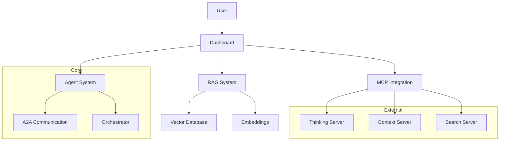

# Guide Templates for agentland.saarland

This template defines the standardized format and content for guides, tutorials, and documentation in agentland.saarland projects. These guides help users and developers understand and utilize the various components of the system.

## Guide Structure

All guides should follow a consistent structure:

1. **Title**: Clear, descriptive title
2. **Metadata**: YAML frontmatter with guide information
3. **Introduction**: Brief overview of the guide's purpose
4. **Prerequisites**: Required knowledge, tools, or setup
5. **Main Content**: Step-by-step instructions or explanations
6. **Examples**: Practical examples demonstrating concepts
7. **Troubleshooting**: Common issues and their solutions
8. **References**: Related resources and documentation
9. **Next Steps**: Suggestions for further learning or exploration

## Guide File Format

```markdown
---
title: "Guide Title"
description: "Brief description of the guide's purpose"
category: "Category (setup|integration|development|deployment|usage)"
tags: ["tag1", "tag2", "tag3"]
difficulty: "beginner|intermediate|advanced"
time_required: "X minutes|hours"
author: "Guide Author"
date: "YYYY-MM-DD"
version: "1.0.0"
---

# {{ title }}

{{ description }}

## Introduction

[Brief introduction to the topic and what the reader will learn]

## Prerequisites

Before you begin, make sure you have:

- [Prerequisite 1]
- [Prerequisite 2]
- [Prerequisite 3]

## [Main Section 1]

[Detailed explanation or step-by-step instructions]

```code
// Code example if applicable
```

## [Main Section 2]

[Detailed explanation or step-by-step instructions]

```code
// Code example if applicable
```

## Examples

### Example 1: [Example Title]

[Description of example]

```code
// Code example
```

### Example 2: [Example Title]

[Description of example]

```code
// Code example
```

## Troubleshooting

### [Issue 1]

[Description of issue and solution]

### [Issue 2]

[Description of issue and solution]

## References

- [Reference 1]
- [Reference 2]
- [Reference 3]

## Next Steps

- [Suggestion for further learning 1]
- [Suggestion for further learning 2]
- [Suggestion for further learning 3]
```

## Guide Categories

Guides should be categorized according to their primary purpose:

1. **Setup Guides**: Installation, configuration, and initial setup
2. **Integration Guides**: Connecting with other systems or services
3. **Development Guides**: Creating or extending components
4. **Deployment Guides**: Deploying to various environments
5. **Usage Guides**: Using existing features and functionality

## Example Guides

### Setup Guide Example

```markdown
---
title: "Setting Up the Development Environment"
description: "A guide for setting up the local development environment for agentland.saarland"
category: "setup"
tags: ["environment", "installation", "prerequisites"]
difficulty: "beginner"
time_required: "30 minutes"
author: "agentland.saarland Team"
date: "2025-05-01"
version: "1.0.0"
---

# Setting Up the Development Environment

This guide will walk you through the process of setting up a local development environment for agentland.saarland.

## Introduction

The agentland.saarland framework requires specific tools and configurations to run properly. This guide will help you set up everything you need to start developing.

## Prerequisites

Before you begin, make sure you have:

- Node.js 18.x or higher
- Python 3.10 or higher
- Git
- A text editor or IDE (VS Code recommended)
- Docker (optional, but recommended)

## Installing Dependencies

### Node.js Dependencies

First, clone the repository and install the Node.js dependencies:

```bash
git clone https://github.com/agentland/saarland.git
cd saarland
npm install
```

### Python Dependencies

Next, set up the Python virtual environment for RAG components:

```bash
cd libs/rag
python -m venv .venv
source .venv/bin/activate  # On Windows: .venv\Scripts\activate
pip install -r requirements.txt
```

## Configuration

### Environment Variables

Create a `.env` file in the root directory based on the `.env.example` template:

```bash
cp .env.example .env
```

Open the `.env` file and update the values according to your setup:

```
# API Keys
MCP_API_KEY=your_mcp_api_key
RAG_API_KEY=your_rag_api_key

# Database Configuration
DB_HOST=localhost
DB_PORT=5432
DB_USER=postgres
DB_PASSWORD=password
DB_NAME=agentland

# Server Configuration
PORT=5000
```

### MCP Configuration

Configure the MCP server connections:

```bash
node scripts/configure-claude-mcp-all.js
```

## Starting the Development Servers

### Start the Dashboard

```bash
./start-dashboard.sh
```

### Start the MCP Servers

```bash
./scripts/start-mcp-servers.sh
```

## Verifying the Setup

Open your browser and navigate to http://localhost:5000. You should see the agentland.saarland dashboard.

To verify the API is working, try:

```bash
curl http://localhost:5000/api/health
```

You should receive a JSON response indicating the system is healthy.

## Examples

### Example: Creating a New Agent

Here's a simple example of creating a new agent:

```typescript
import { BaseAgent } from '../agent-base/base-agent';

export class MyCustomAgent extends BaseAgent {
  constructor() {
    super('my-custom-agent');
  }
  
  async process(message) {
    console.log('Processing message:', message);
    return { success: true, result: 'Message processed' };
  }
}
```

## Troubleshooting

### Port Already in Use

If you see an error like "Port 5000 is already in use", you can either:

1. Stop the process using that port
2. Modify the `PORT` in your `.env` file

### Node.js Version Issues

If you encounter errors related to Node.js version, make sure you're using a compatible version:

```bash
node -v  # Should be v18.x or higher
```

If needed, you can use nvm to install and switch to the correct version:

```bash
nvm install 18
nvm use 18
```

## References

- [Node.js Documentation](https://nodejs.org/docs)
- [Python Virtual Environments](https://docs.python.org/3/tutorial/venv.html)
- [Docker Documentation](https://docs.docker.com/)

## Next Steps

- [Explore the Core API](./core-api-guide.md)
- [Create Your First Agent](./creating-agents-guide.md)
- [Working with the RAG System](./rag-system-guide.md)
```

### Integration Guide Example

```markdown
---
title: "Integrating with MCP Servers"
description: "A guide for integrating agentland.saarland with MCP servers for extended AI capabilities"
category: "integration"
tags: ["mcp", "integration", "ai"]
difficulty: "intermediate"
time_required: "1 hour"
author: "agentland.saarland Team"
date: "2025-05-05"
version: "1.0.0"
---

# Integrating with MCP Servers

This guide explains how to integrate your agentland.saarland application with Model Context Protocol (MCP) servers to extend its AI capabilities.

## Introduction

The Model Context Protocol (MCP) allows agentland.saarland to leverage specialized AI services. By integrating with MCP servers, you can add capabilities such as sequential thinking, context-aware processing, and external knowledge acquisition.

## Prerequisites

Before you begin, make sure you have:

- A running agentland.saarland installation
- MCP API credentials
- Basic understanding of asynchronous JavaScript
- Familiarity with REST APIs

## MCP Server Configuration

### Setting Up Server Connections

First, configure the MCP server connections in your `configs/mcp/servers.json` file:

```json
{
  "servers": [
    {
      "id": "sequentialthinking",
      "name": "Sequential Thinking",
      "url": "${MCP_THINKING_SERVER_URL}",
      "apiKey": "${MCP_API_KEY}",
      "enabled": true,
      "timeout": 30000,
      "description": "Recursive thought generation"
    },
    {
      "id": "context7",
      "name": "Context 7",
      "url": "${MCP_CONTEXT_SERVER_URL}",
      "apiKey": "${MCP_API_KEY}",
      "enabled": true,
      "timeout": 20000,
      "description": "Context awareness and documentation access"
    },
    {
      "id": "brave-search",
      "name": "Brave Search",
      "url": "${MCP_BRAVE_SEARCH_URL}",
      "apiKey": "${MCP_API_KEY}",
      "enabled": true,
      "timeout": 10000,
      "description": "External knowledge acquisition"
    }
  ]
}
```

Make sure your `.env` file includes the necessary environment variables:

```
MCP_API_KEY=your_mcp_api_key
MCP_THINKING_SERVER_URL=https://api.example.com/thinking
MCP_CONTEXT_SERVER_URL=https://api.example.com/context
MCP_BRAVE_SEARCH_URL=https://api.example.com/search
```

### Testing Server Connections

Use the verification script to test your server connections:

```bash
node scripts/verify-mcp-setup.js
```

## Using MCP in Your Application

### Client Configuration

Initialize the MCP client in your application:

```typescript
import { ClaudeMcpClient } from 'libs/mcp/src/client/claude-mcp-client';

const mcpClient = new ClaudeMcpClient({
  apiKey: process.env.MCP_API_KEY,
  defaultServer: 'sequentialthinking'
});
```

### Making MCP Requests

Send requests to MCP servers:

```typescript
async function generateThoughts(prompt) {
  try {
    const response = await mcpClient.sendRequest({
      server: 'sequentialthinking',
      prompt,
      maxTokens: 1000,
      temperature: 0.7
    });
    
    return response.thoughts;
  } catch (error) {
    console.error('Error generating thoughts:', error);
    throw error;
  }
}
```

## Examples

### Example 1: Sequential Thinking for Problem Solving

```typescript
import { ClaudeMcpClient } from 'libs/mcp/src/client/claude-mcp-client';

async function solveComplexProblem(problem) {
  const mcpClient = new ClaudeMcpClient({
    apiKey: process.env.MCP_API_KEY,
    defaultServer: 'sequentialthinking'
  });
  
  const prompt = `
    I need to solve the following problem step by step:
    ${problem}
    
    Please think through this carefully and provide a detailed solution.
  `;
  
  const response = await mcpClient.sendRequest({
    prompt,
    maxTokens: 2000,
    temperature: 0.3
  });
  
  return response.solution;
}

// Usage
const solution = await solveComplexProblem(
  'How can we optimize our database queries to reduce load during peak hours?'
);
console.log(solution);
```

### Example 2: Using External Knowledge

```typescript
import { ClaudeMcpClient } from 'libs/mcp/src/client/claude-mcp-client';

async function researchTopic(topic) {
  const mcpClient = new ClaudeMcpClient({
    apiKey: process.env.MCP_API_KEY,
    defaultServer: 'brave-search'
  });
  
  const prompt = `
    I need comprehensive information about:
    ${topic}
    
    Please provide detailed, accurate, and up-to-date information.
  `;
  
  const response = await mcpClient.sendRequest({
    prompt,
    maxTokens: 3000,
    temperature: 0.5
  });
  
  return response.research;
}

// Usage
const research = await researchTopic('Recent advances in natural language processing');
console.log(research);
```

## Troubleshooting

### Connection Issues

If you're experiencing connection issues:

1. Verify your API keys and server URLs
2. Check your network connectivity
3. Ensure the MCP servers are operational
4. Check for firewall or proxy settings that might block requests

### Request Timeouts

If requests are timing out:

1. Increase the timeout value in your server configuration
2. Simplify complex requests to reduce processing time
3. Check server load and availability

## References

- [MCP API Documentation](https://docs.example.com/mcp-api)
- [Claude AI Documentation](https://docs.example.com/claude-ai)
- [Configuring Timeouts and Retries](https://docs.example.com/mcp-timeouts)

## Next Steps

- [Advanced MCP Usage Patterns](./advanced-mcp-guide.md)
- [Error Handling Best Practices](./error-handling-guide.md)
- [Load Balancing MCP Requests](./load-balancing-guide.md)
```

## Guide Repository Structure

Guides should be organized in a repository with the following structure:

```
ai_docs/guides/
├── README.md                      # Overview of guides
├── architecture.md                # Architecture overview
├── backup_recovery_guide.md       # Backup and recovery
├── ci_cd_guide.md                 # CI/CD integration
├── claude_integration_guide.md    # Claude integration
├── configuration_guide.md         # Configuration
├── enterprise_integration_guide.md # Enterprise integration
├── error_handling_guide.md        # Error handling
├── i18n_guide.md                  # Internationalization
├── introduction.md                # Introduction to the system
├── mcp_integration_guide.md       # MCP integration
├── neural_framework_guide.md      # Neural framework
├── quick_start_guide.md           # Quick start
├── rag_system_guide.md            # RAG system
├── recursive_debugging_guide.md   # Recursive debugging
├── security_policy.md             # Security policy
└── system_requirements.md         # System requirements
```

## Style Guidelines

All guides should follow these style guidelines:

1. **Use Clear Language**: Write in simple, clear language
2. **Be Concise**: Keep explanations concise but complete
3. **Use Examples**: Include practical examples
4. **Follow Formatting**: Use consistent Markdown formatting
5. **Include Code Samples**: Provide relevant code snippets
6. **Use Screenshots**: Include screenshots for visual clarity
7. **Be Consistent**: Maintain consistent terminology
8. **Maintain Structure**: Follow the guide structure
9. **Include Troubleshooting**: Address common issues
10. **Link Related Guides**: Cross-reference related guides

## Flowchart and Diagram Guidelines

When including flowcharts or diagrams in guides:

1. **Use Mermaid**: Use Mermaid syntax for diagrams
2. **Keep It Simple**: Avoid overly complex diagrams
3. **Include Legend**: Provide a legend for symbols
4. **Use Consistent Colors**: Maintain consistent color coding
5. **Include Descriptions**: Add textual descriptions

Example Mermaid diagram:

```markdown
## System Architecture

The following diagram illustrates the high-level architecture of agentland.saarland:



This architecture shows how the dashboard interacts with the core agent system, MCP integration, and RAG system components.
```

## Interactive Guide Elements

For interactive elements in guides:

1. **Code Sandboxes**: Link to code sandboxes for experimentation
2. **Tutorials**: Provide step-by-step tutorials
3. **Checklists**: Include checklists for complex procedures
4. **Videos**: Link to video tutorials when appropriate
5. **Interactive Diagrams**: Use interactive diagrams when possible

## Guide Review Process

All guides should undergo a review process:

1. **Technical Review**: Ensure technical accuracy
2. **Editorial Review**: Check grammar, style, and clarity
3. **User Testing**: Test with target audience
4. **Feedback Collection**: Gather and incorporate feedback
5. **Regular Updates**: Update guides as the system evolves

## Localization Guidelines

When localizing guides:

1. **Maintain Structure**: Keep the same structure across languages
2. **Adapt Examples**: Use culturally appropriate examples
3. **Use Local Formats**: Adapt dates, times, and numbers
4. **Translate Terminology**: Provide glossaries for technical terms
5. **Review Translations**: Have native speakers review translations

## Best Practices

1. **Start with User Needs**: Focus on what users need to accomplish
2. **Provide Context**: Explain why, not just how
3. **Be Practical**: Include real-world scenarios
4. **Stay Current**: Keep guides updated with latest features
5. **Test Instructions**: Verify all steps work as documented
6. **Link to Resources**: Provide links to further reading
7. **Use Consistent Voice**: Maintain a consistent tone and voice
8. **Avoid Assumptions**: Don't assume prior knowledge beyond prerequisites
9. **Include Alternatives**: Provide alternative approaches when applicable
10. **Gather Feedback**: Continuously improve based on user feedback

## Conclusion

Following these guide templates and guidelines ensures consistent, high-quality documentation across the agentland.saarland project. Standardized guides improve the user experience, reduce support requirements, and help users get the most out of the system.

## Related Templates

| Template | Relationship |
|----------|--------------|
| [Structure](./template_structure.md) | Documents the file and directory structure |
| [Prompts](./template_prompts.md) | Provides AI prompt templates used in guides |
| [Memory Bank](./template_memory_bank.md) | Sources information from memory updates |
| [Changelog](./template_changelog.md) | Tracks changes that need to be documented in guides |

## Integration Points

Guide documentation integrates with various components of the agentland.saarland system:

1. **Memory Bank** - Uses memory updates as a source for documentation content
2. **CI/CD Pipeline** - Guides are validated as part of the CI/CD process
3. **Dashboard** - Guides are accessible through the dashboard interface
4. **MCP Integration** - Guides document MCP capabilities and integration patterns

## Changelog

- **1.0.0** (2025-05-16): Initial version based on the agentland.saarland project